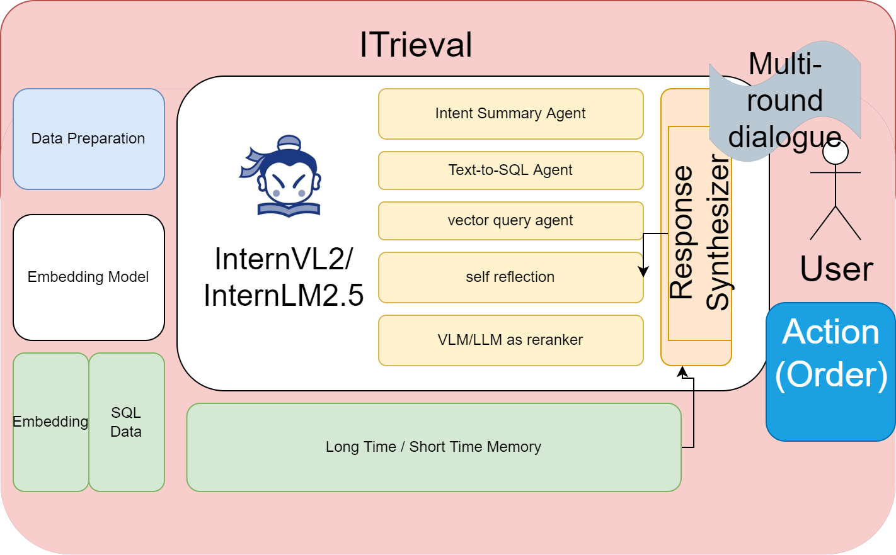
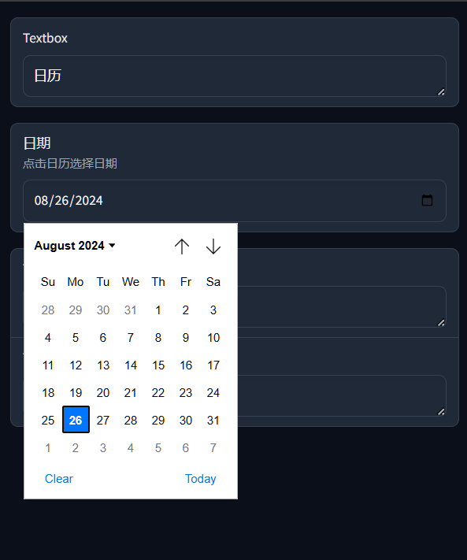
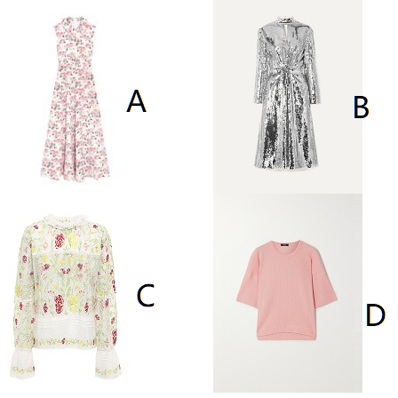

# ITrieval

<<<<<<< HEAD

Improved dense & sparse multi-modal retrieval system built to be a versatile component of LLM RAG system.
=======
Improved dense & sparse multi-modal retrieval system built to be a versatile component of LLM RAG system. 

>>>>>>> refs/remotes/origin/main

 
Life information with memory and planning
 

Courtesy of the [Intern Studio Training Camp](https://github.com/InternLM/Tutorial).

## ITrieval  —— 个人生活助手
本项目致力于打造一个针对选定话题不断讨论直到完成选择的生活助手：
- 基于InternLM构建的大模型与开源llama-index检索系统深度融合
- 通过vectordb, NL2SQL技术对多来源的知识进行总结
- 针对个人的回复进行意图识别, 总结记录用户喜好
- 利用internlm/internvl 对检索得到选择进行重排
- 保持决策记录用于计划生成, 实现用户为中心的小助手

本项目基于开源书生浦语大模型做为基座, 通过对客观知识来源进行检索与对用户多轮对话总结得到的偏好相结合, 实现可以针对同一话题不断讨论直到帮助记录用户完成选择.实现一个以用户为中心的生活小助手.
项目还在不断向前演进中

Please try the latest InternLM 2.5 Model at [HF Repo](https://huggingface.co/internlm) More info at [source repo](https://github.com/internlm).

[Home page of internlm](https://intern-ai.org.cn/home).

WIP. 
